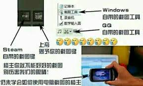

# 第二章 常用工具

## 学会写文档

### Markdown

<Card
  url="https://markdown.com.cn/intro.html"
  title="Markdown 教程"
  describe="Markdown 是一种轻量级的标记语言，可用于在纯文本文档中添加格式化元素。Markdown 由 John Gruber 于 2004 年创建，如今已成为世界上最受欢迎的标记语言之一。"
/>

### README.md

一份模版

### 盘古之白

### 画图: Excalidraw

Excalidraw 是近两年新起的一款画图工具，主要包含白板、流程图的能力，它简单好用有画图界的 Markdown 之称。

个人喜欢 Excalidraw，Drawio 这么强大的功能到底能用上多少，这是个问题。Excalidraw 很棒，精简又强大。默认配色也非常漂亮。是手绘风格，唯一的问题是没有中文手绘风格的字体

<Card
  url="https://juejin.cn/post/7119512386029125668"
  title="5 分钟了解 Excalidraw - 掘金"
  describe="介绍个人非常喜欢的开源画图工具 Excalidraw：基础功能、特点、开发小故事。 画风很手绘，推进大家使用。"
/>

### 画图: Drawio

<Card
  url="http://draw.io/"
  title="Draw.io"
  describe="非常强大的流程图制作器和在线图表工具"
/>

## 如何正确截屏

没错我并没有在开玩笑，真的就有人天天拿手机拍屏幕发图片

### Windows 截屏

<Card
  url="https://support.microsoft.com/zh-cn/windows/%E4%BD%BF%E7%94%A8%E6%88%AA%E5%9B%BE%E5%B7%A5%E5%85%B7%E6%8D%95%E8%8E%B7%E6%88%AA%E5%9B%BE-00246869-1843-655f-f220-97299b865f6b"
  title="使用截图工具捕获截图 - Microsoft 支持"
  describe="Windows 11 / Windows 10"
/>

<Card
  url="https://robotrs.lenovo.com.cn/ZmptY2NtYW5hZ2Vy/p4data/Rdata/Rfiles/jietu.html"
  title="Windows 截屏"
  describe="Windows 8 / Windows 7 / Windows XP"
/>

### MacOS 截屏

<Card
  url="https://support.apple.com/zh-cn/guide/mac-help/mh26782/mac"
  title="在 Mac 上截屏或录屏"
  describe="在 Mac 上，按下 Shift-Command-5（或使用启动台）以打开“截屏”并显示工具。"
/>

### Linux 截屏

<Card
  url="https://linux.cn/article-10070-1.html"
  title="在 Linux 下截屏并编辑的最佳工具"
  describe="有几种获取屏幕截图并对其进行添加文字、箭头等编辑的方法，这里提及的的屏幕截图工具在 Ubuntu 和其它主流 Linux 发行版中都能够使用。"
/>

### iOS 截屏

<Card
  url="https://support.apple.com/zh-cn/102616"
  title="在 iPhone 上截屏"
  describe="快速存储屏幕上的内容。"
/>

### Android 截屏

<Card
  url="https://support.google.com/android/answer/9075928?hl=zh-Hans"
  title="在 Android 设备上抓取屏幕截图或录制屏幕"
  describe="您可以抓取手机屏幕画面（屏幕截图），也可以录制屏幕画面视频。拍摄屏幕后，您可以查看、编辑和分享所拍的图片或视频。"
/>

### 网页长截图

<Card
  url="https://www.awesomescreenshot.com/"
  title="Awesome Screenshot & Screen Recorder"
  describe="这个工具几乎支持所有的浏览器"
/>

- Chrome / Eege 也可以使用 [GoFullPage](https://chromewebstore.google.com/detail/gofullpage-full-page-scre/fdpohaocaechififmbbbbbknoalclacl)
- Firefox 自带一个截图工具，不过功能比较弱

### 图床

[嗯，图片就交给它了](https://sspai.com/post/40499)

### PasteBin

[从命令行轻松将文本片段上传到类似 Pastebin 的服务中](https://linux.cn/article-11691-1.html)

[fars.ee is a temporary deployment of PasteBin by farseerfc](https://fars.ee/)

## 新时代大陆青年必备技能

[常用工具使用代理 · hlyani](https://hlyani.github.io/notes/proxy.html)

proxychains-ng 原理解析

[proxychains-ng 原理解析](https://void-shana.moe/posts/proxychains-ng)

### Clash

或者使用：

## 网络路由

[小菜学网络 | 小菜学编程](https://fasionchan.com/network/)

### 抓包技术 Wireshark

[Wireshark 基本使用](https://www.misaka-9982.com/2022/03/21/Wireshark%E5%9F%BA%E6%9C%AC%E4%BD%BF%E7%94%A8/)

## 编程基础

### DevOps 实践

### 单元测试

[单元测试：概念、作用与实践](https://www.duyixian.cn/2021/05/24/unittest/)

[有关单元测试的 5 个建议  | Piglei](https://www.piglei.com/articles/5-tips-on-unit-testing/)

### CI/CD 和 DevOps

### Docker

[Docker — 从入门到实践](https://yeasy.gitbook.io/docker_practice/)

### 网关：Nginx

就算最终不用，也要学习了解一下 nginx

[nginx-tutorial](https://dunwu.github.io/nginx-tutorial/#/)

### 网关：Caddy

[为什么个人项目我更推荐使用Caddy?](https://icebreaker.top/articles/2023/6/24-use-caddy-for-happy/)

## TLS/SSL

[有关 TLS/SSL 证书的一切](https://www.kawabangga.com/posts/5330)

[QUIC原理与KCP会话握手借鉴](https://hulinhong.com/2021/02/26/quic_intro/)

## 设计

### 52 设计原则

[小红书产品设计中心](https://rpdc.xiaohongshu.com/)

